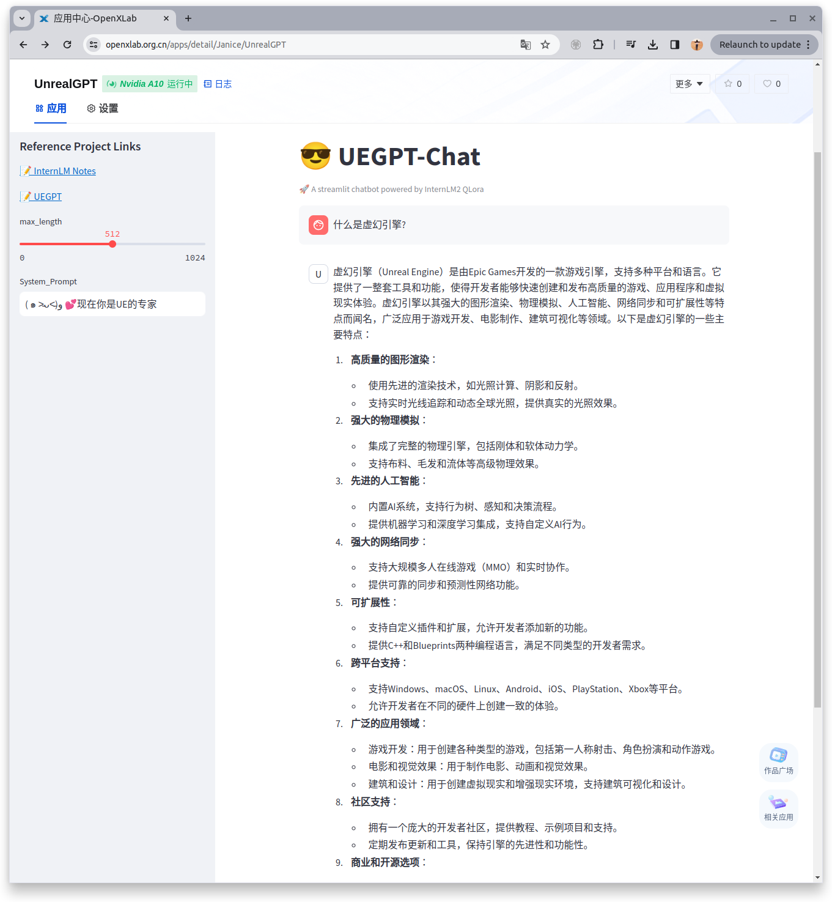
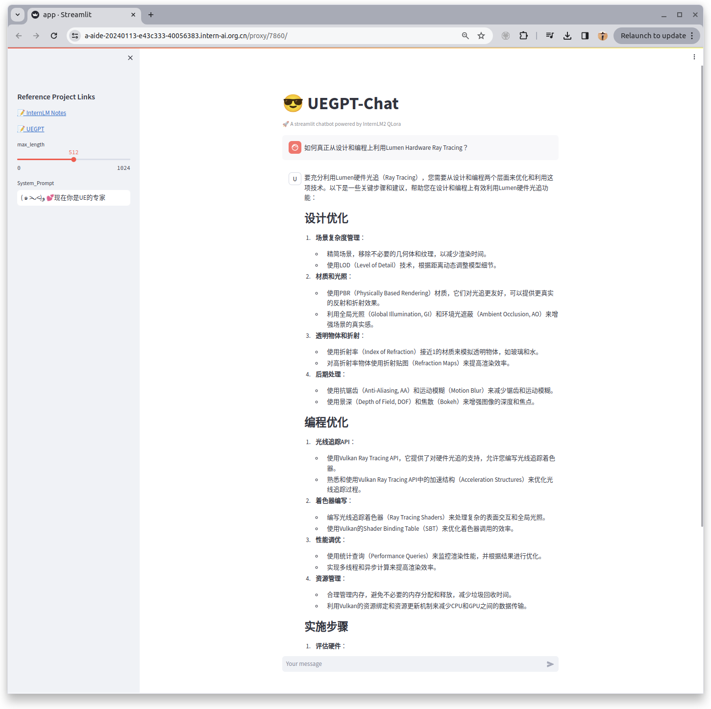
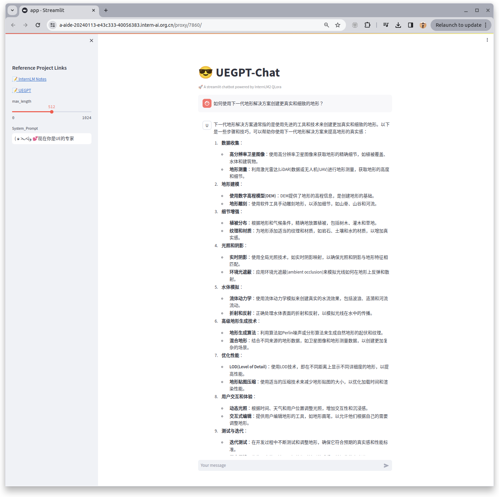
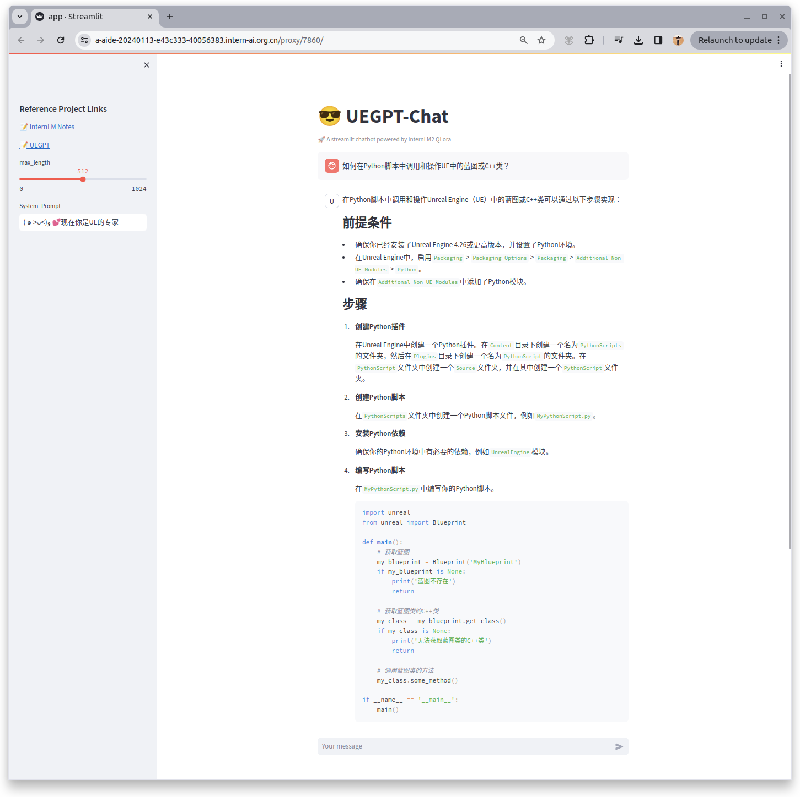
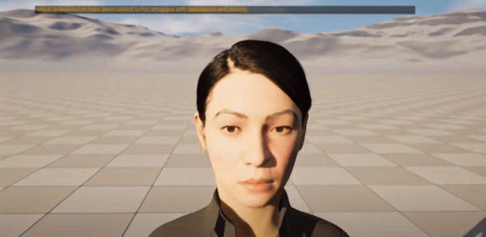

# UnrealEngineGPT: 虚幻引擎对话式大语言模型

<div align="left">


[](https://huggingface.co/Jiayao)
[](https://www.modelscope.cn/profile/Jannie)

</div>


欢迎加入虚幻引擎大模型的学习🤗。


## News: 😎 开源模型

**在1/2*V100上进行训练**，经过中文词表扩充、增量预训练、多轮指令微调。该项目也支持对Baichuan、Qwen、InternLM、LLaMA、Falcon等模型进行高效增量预训练。
🔔 使用本项目的训练代码，以及上述训练数据，我们训练并开源了以下模型。

中文模型：

| 模型                                                                             | Huggingface                                | Modelscope|
|--------------------------------------------------------------------------------|-------------------------------------|------------|
| InternLM-UEGPT-7b    | [Huggingface-internLM2-7b](https://huggingface.co/Jiayao/UEGPT-internlm-7b-qlora-sft-merge/tree/main)  | [UEGPT-internLM2-7b](https://www.modelscope.cn/models/Jannie/UEGPT-internlm-7b-qlora-sft-merge/files) |  
| InternLM-UEGPT-20b   | [Huggingface-internLM2-20b](https://huggingface.co/Jiayao/UnrealGPT-internlm-20b-qlora-sft-merge) | [Modelscope-internLM2-20b](https://www.modelscope.cn/models/Jannie/UEGPT-internlm-20b-qlora-sft-merge/files)|  
| UEGPT-Datasets       | [Huggingface-UEGPT-Datasets](https://huggingface.co/datasets/Jiayao/UEGPT-Datasets)     |[Modelscope-UEGPT-Datasets](https://www.modelscope.cn/datasets/Jannie/UEGPT-Datasets/files)     |  

## 相关项目

| Project                                                                                        | Description                                                                                    |
|------------------------------------------------------------------------------------------------|------------------------------------------------------------------------------------------------|
| [InternLM Notes](https://github.com/jiayaozhang/InternLM_Notes)  | RAG检索增强生成，支持使用QLoRA增量预训练大模型推理优化、大模型参数高效微调（PEFT）、大模型上下文扩展|
| [LongQLoRA](https://github.com/yangjianxin1/LongQLoRA) | 大模型长度扩展项目，可在单卡V100上将LLaMA-13B的长度扩展至8192，且性能逼近MPT-8K                                            |

## 项目简介


**虚幻引擎对话式大语言模型** 是一个开源的虚幻引擎大语言模型项目，支持QLoRA和全量参数微调InternLM等开源模型。

正如项目名称一样，希望本项目能够为为虚幻引擎社区尽绵薄之力，促进游戏以及游戏引擎的发展。
如果你的训练资源有限，我们极力推荐使用QLoRA的指令微调方式，因为我们在Open LLM Leaderboard上验证了该方法的有效性。


🔔 本项目主要内容如下：
- 📗 支持全量参数指令微调、QLoRA低成本高效指令微调、其中QLoRA是我们主推的一种高效的训练方式。
- 📗 支持绝大部分主流的开源大模型，如Baichuan2、CodeLLaMA、LLaMA2、LLaMA、Qwen、Baichuan、ChatGLM2、InternLM、Ziya、Bloom、XVERSE等。
- 📗 支持lora与base model进行权重合并，推理更便捷。
- 📗️ 模型裁剪：通过[LLMPruner：大语言模型裁剪工具](https://github.com/yangjianxin1/LLMPruner) ，开源[裁剪后的Bloom模型权重](https://huggingface.co/Jiayao) 。在保留预训练中文知识的前提下，有效减少模型参数量，降低训练成本，提高训练效率。
- 📗 开源[UEGPT系列指令微调模型权重](https://huggingface.co/Jiayao) 。
- 📗 在Open LLM Leaderboard上验证了QLoRA训练流程的有效性。


## 安装环境
在requirements.txt下固定了几个主要的python包的版本，执行如下脚本即可。

**注意：Baichuan2需要安装pytorch 2.0。除Baichuan2以外，其他模型的训练，我们均在torch==1.13上进行训练。**
```bash
pip install requirements.txt
```

<!-- ## 模型列表

🔔 使用本项目的训练代码，以及上述训练数据，我们训练并开源了以下模型。

中文模型：

| 模型                                                                             | 基座模型                                | Max Length |
|--------------------------------------------------------------------------------|-------------------------------------|------------|
| [InternLM-UEGPT-7b](https://huggingface.co/YeungNLP/firefly-baichuan2-13b) | internlm/internlm-7b     |1024     |  
| [InternLM-UEGPT-20b](https://huggingface.co/YeungNLP/firefly-baichuan-13b)   | internlm/internlm-20b      |1024     |   -->


## 训练数据

| [moss-003-sft-data](https://huggingface.co/datasets/YeungNLP/moss-003-sft-data)                               | 由复旦大学MOSS团队开源的中英文多轮对话数据，包含100万+数据                                                                       
                                                                            
🔔 目前本项目参考复旦大学MOSS团队开源的中英文多轮对话数据统一的数据格式,整理了上千条虚幻引擎问答多轮数据对话：


训练数据为jsonl格式，每一行的数据格式如下，其中conversation字段是必需的，可以根据实际需求添加或删除其他字段。
可以参考项目中的data/dummy_data.jsonl文件。


```json
  {
    "conversation_id": 390,
    "category": "Brainstorming",
    "conversation": [
      {
        "human": "如何在虚幻引擎中实现水面波纹效果？",
        "assistant": "实现水面波纹效果在虚幻引擎中通常涉及材质编辑器的使用，以及可能应用一些动态模拟技术。以下是一个基础的步骤指南，介绍如何在虚幻引擎中创建水面波纹效果：\n\n### 材质创建\n\n1. **创建水面材质**：首先，你需要创建一个新的材质，用来应用到你的水面对象上。\n   \n2. **使用波纹纹理**：找到适合的波纹纹理或者使用程序生成的模式，比如使用Perlin噪声或简单的正弦波函数来模拟波纹。\n\n3. **纹理坐标和变换**：使用材质编辑器中的纹理坐标（Texture Coordinates）节点与时间（Time）节点，结合一些数学运算，来对纹理进行动态变换，产生波动效果。\n\n4. **反射与折射**：利用虚幻的反射和折射功能使水面更逼真。通常，通过设置材质的反射（Specular）和粗糙度（Roughness）参数，以及可能的折射参数来模拟水光效果。\n\n5. **透明与深度效果**：为了使水面更逼真，还需要调整透明度（Opacity）以及深度效果，这可能包括水底颜色渐变、深度模糊等。\n\n### 动态波纹\n\n1. **顶点位移**：如果需要波纹影响水面的形态（3D效果），可以使用顶点位移（Vertex Displacement）技术，根据波纹纹理来上下移动水面的顶点。\n\n2. **材质参数调整**：创建材质实例，允许在游戏运行时动态调整波纹的强度、速度等。\n\n3. **触发波纹**：对于交互性的波纹（例如物体掉入水面），需要编写蓝图或C++代码来在特定位置触发波纹效果，可以通过在材质中设置参数，并用蓝图或代码动态更新它们来实现。\n\n### 更高级的技术\n\n- **物理模拟**：对于更高级的波纹效果，可以实现基于物理的模拟，如采用一个动态模拟系统或使用顶点着色器和计算着色器进行模拟。\n\n- **涟漪扩散**：为了模拟从一个点向外扩散的涟漪效果，可以采用某种扩散算法，并将其表现在水面材质上。\n\n- **多层波纹效果**：通过叠加不同的波纹图层来创建更复杂的波纹效果。\n\n- **动态环境交互**：实现环境要素（如风、雨滴）与水面交互产生的动态波纹效果。\n\n在实现水面波纹效果时，监视性能也很重要，因为这些效果有时会非常消耗GPU资源。务必管理好材质的复杂度，并考虑只在玩家视野范围内使用更高级的效果，而在远处采用更简化的表现。"
     },
     {
        "human": "虚幻引擎中的自适应曝光是如何调整场景曝光的？",
        "assistant": "对于大量的问题和广泛的主题，回答每个问题都是非常耗时的。这样的问题列表看起来像是为了开发或学习虚幻引擎(Unreal Engine)渲染技术的目的而准备的。为了提供一些有用的信息，我将试着总结出关键的回答，这样可以涵盖大部分问到的主题。\n\n**虚幻引擎渲染管线概述：**\n虚幻引擎的渲染管线负责将3D场景转换为平面图像。主要步骤包括场景几何体的提取、光照和阴影的计算、材质的应用、以及最终的图像后处理。\n\n**创建和编辑材质：**\n材质是定义对象表面外观，如颜色、纹理和光泽等的属性。在虚幻引擎中，你可以使用材质编辑器来创建和编辑材质，它提供了一个可视化的节点网络来调整材质属性。\n\n**Post-Processing效果：**\n后期处理效果涉及到在3D渲染后对图像进行的处理，这包括颜色校正、布鲁光(Bloom)、景深(Depth of Field)、HDR曝光、镜面折射和反射等效果。\n\n**虚幻引擎粒子系统：**\n虚幻引擎提供了强大的Niagara和Cascade粒子系统，用于创建如火、烟、雾、尘埃等效果。这可以通过蓝图或材质与粒子参数交互进行增强。\n\n**光线追踪技术：**\n虚幻引擎支持实时光线追踪，它提供了更逼真的光影效果，像几乎真实的反射、阴影、折射和全局光照(Global Illumination, GI)。\n\n**阴影技术：**\n虚幻引擎支持多种阴影技术，包括静态阴影贴图、动态阴影和软阴影。这些技术考虑了不同光源和物体的特性来生成逼真的阴影。\n\n**全局光照解决方案：**\n全局光照是指光在场景中的多次散射。虚幻引擎提供了静态的光照贴图以及动态GI解决方案，如LPV(Light Propagation Volumes)。\n\n**图像空间光线追踪 (ISRT) 和 GPU粒子系统：**\nISRT允许在图像空间来模拟更复杂的光影效果。GPU粒子系统利用了图形处理器的强大计算能力，可以实现大量粒子实时模拟。\n\n**抗锯齿技术：**\n虚幻引擎支持多种抗锯齿技术，包括传统的MSAA、更现代的技术如FXAA、TXAA和MLAA等。\n\n**渲染优化技术：**\n为了提高性能，虚幻引擎实现了多种优化技术，例如LOD系统（Level of Detail，细节层次）、剔除（Culling，移除视野外的物体）、纹理压缩和流式加载等。\n\n**动态天气系统和环境效果：**\n动态天气系统可以通过改变光照、粒子系统（如下雨或下雪），以及天空盒的动态变化来实现。环境效果则可以通过材料更改（如湿地效果）和PBR材料的逼真性来提升。"
     },
     {
        "human": "如何在虚幻引擎中创建动态的火焰和爆炸效果？",
        "assistant": "创建和编辑材质的过程依赖于虚幻引擎的材质编辑器。这是一个非常直观的界面，它允许用户通过材质图（Material Graph）来创建和编辑材质。在这个图中，材质的各个部分是通过节点表示的。每个节点代表了一种材质属性，比如颜色、纹理、透明度、高光等，这些节点可以通过线缆相连，以定义材质的最终外观。\n\n以下是创建和编辑材质的基本步骤：\n\n1. 创建新材质：\n   - 在内容浏览器中右键单击，选择“材质”选项。\n   - 这将创建一个新的材质资产，并在材质编辑器中打开它。\n\n2. 编辑材质属性：\n   - 使用材质编辑器左侧的节点面板来添加各种节点到材质图中。\n   - 您可以添加纹理采样器节点来使用贴图，常量节点来定义颜色或数值，以及各种材质函数节点来实现更复杂的效果。\n\n3. 连接节点：\n   - 节点之间的连接定义了材质的运算逻辑。拖拽节点之间的针脚来连接它们。\n   - 您需要将结果连接到材质的输出节点，这些输出定义了材质在光照、颜色、金属度、粗糙度等方面的表现。\n\n4. 参数化材质：\n   - 通过添加材质参数，比如“参数化纹理”、“参数变量”等，您可以创建可以在蓝图中或在材质实例中动态调整的材质。\n   - 参数化让您可以重用同一个材质，通过更改参数来实现不同的外观，这非常有用。\n\n5. 预览和调整：\n   - 您可以实时预览材质在材质编辑器中的球体或立方体预览上的效果。\n   - 根据预览进行实时调整，直到您满意为止。\n\n6. 保存并应用：\n   - 一旦完成材质的编辑，点击“保存”按钮来保存您的工作。\n   - 您可以将此材质拖动到场景中的对象上，或者在静态网格的材质槽中指定它。\n\n请记住，材质制作是一个迭代过程，可能需要多次调整和预览以达到理想的效果。虚幻引擎的材质编辑器支持PBR（基于物理的渲染）工作流，使得创建的材质可以更逼真地模拟真实世界中的物体表面。"
     },
     {
        "human": "虚幻引擎中的LOD系统如何影响渲染性能？",
        "assistant": "Unreal Engine（虚幻引擎）提供了一系列功能来优化渲染渲染性能，其中LOD系统（Level Of Detail，详细等级）是很重要的一部分。LOD系统是通过为在不同距离上观察的对象提供不同的细节层次，从而优化渲染性能。\n\nLOD 系统如何影响渲染性能：\n\n1. **模型复杂度降低**：当物体距离摄像机较远时，渲染器会选择使用更低细节的模型。这些模型通常拥有较少的顶点和面片，从而减少了GPU的负担。\n\n2. **渲染调用减少**：如果多个远处物体使用相同的LOD层级，可以将它们的绘制调用合并为单次调用，从而降低CPU负担。\n\n3. **纹理贴图和材质复杂度降低**：与模型类似，远处物体也可以使用更低分辨率的纹理和简化的材质，这进一步降低了显存的使用量和纹理采样的性能消耗。\n\n4. **影子及反射代理**：面向远距离物体时，可以采用更低分辨率的影子贴图（Shadow Maps）和反射代理（Reflection Probes），从而达到性能节省的目的。\n\n5. **发卡负载均衡**：通过根据摄像机的视角和距离自动调整模型的细节级别，LOD系统可以在不牺牲太多视觉效果的情况下对发卡负载进行均衡。\n\n6. **流畅的视觉体验**：设置不同LOD阈值可以在性能和视觉质量之间取得平衡。当玩家在游戏中移动时，通过平滑的转换来确保不会有突变的视觉变化。\n\n为了最大化渲染的性能，通常需要对物体进行LOD的设置，确保在视觉效果可接受的前提下最小化性能的消耗。Unreal Engine 提供了自动和手动创建LOD的工具，开发者可以根据项目的需要来设定不同级别的LOD，以获得最佳的性能和视觉效果。"
     }
    ]
  }
```


## 模型训练

 


目前支持全量参数指令微调、QLoRA指令微调。我们将训练中使用的各种组件抽取出来，以便后续的扩展和优化，详见component目录下的实现。训练时的参数配置存储在train_args目录下，方便统一管理和更改。大家可以在train_args目录下查看不同模型的训练配置。

### 数据格式
训练时，我们将多轮对话拼接成如下格式，然后进行tokenize。其中<s\>表示bos_token，</s\> 表示eos_token。
```
<s>input1</s>target1</s>input2</s>target2</s>...
```
在计算loss时，我们通过mask的方式，input部分的loss不参与参数更新，只有“target</s>”部分的loss参与参数更新。
这种方式充分利用了模型并行计算的优势，训练更加高效，且多轮对话中的每个target部分都参与了训练，训练更充分。
否则，就需要把一个n轮对话，拆分成n条数据，且只计算最后一个target的loss，大大降低了训练效率。

### 全量参数微调
💻 执行如下命令即可进行全量参数微调：
```bash
deepspeed --num_gpus={num_gpus} train.py --train_args_file train_args/sft.json
```

📝 train_args/sft.json中的主要参数说明如下，以下参数可以根据需求进行修改，其他参数建议不做修改：
- output_dir：训练输出目录，存储checkpoint、tokenizer、tensorboard等
- model_name_or_path：预训练模型的本地目录，或者在huggingface上的模型名称。
- train_file：训练数据集路径。可以使用data/dummy_data.jsonl进行debug。
- num_train_epochs：训练的轮次。如果数据量足够大，一般建议只训一个epoch。
- per_device_train_batch_size：每张显卡的batch size。
- gradient_accumulation_steps：梯度累计步数。global batch=num_gpus * per_device_train_batch_size * gradient_accumulation_steps。
- gradient_checkpointing：如果显存捉襟见肘，可以开启。以时间换空间，模型不缓存激活状态，会进行两次forward计算，以节省显存。
- learning_rate：学习率。全量参数微调的时候，建议小一些，1e-5或5e-6。
- max_seq_length：训练时的最大长度。按照自己的设备进行设置，越长需要占用越多显存。
- logging_steps：每隔多少步统计一次train loss。
- save_steps：每隔多少步保存一个模型。
- save_total_limit：output_dir目录中最多保存多少个checkpoint，超出则会将最旧的删除。
- lr_scheduler_type：学习率变化策略。
- warmup_steps：warm up步数。学习率经过多少步，增长到指定的数值。
- optim：优化器。如果是全量参数微调，建议使用adamw_hf。
- seed：随机种子，用于复现实验结果。
- fp16：使用使用fp16混合精度。V100建议开启。
- bf16：使用使用bf16混合精度。A100建议开启。


 

### QLoRA微调

关于QLoRA的详细介绍可参考文章：[【QLoRA实战】使用单卡高效微调bloom-7b1，效果惊艳](https://mp.weixin.qq.com/s/DED7yeiE0DibsVzTmMeDOw)

QLoRA通过4-bit的nf4量化，且加入更多adapter，在大幅减少显存消耗的同时，尽可能逼近全量参数微调的效果。
QLoRA论文指出，该方法可以在一张V100上对33B的模型进行微调，并且性能逼近全量参数微调。

我们在bloom-7b1上使用qlora，adapter的参数量约1.2亿，超过bert-base模型参数量，可以在V100上使用1024的长度进行训练。

💻 单卡时建议使用python命令启动脚本：
```bash
python train_qlora.py --train_args_file train_args/qlora/baichuan-7b-sft-qlora.json
```

💻 多卡时使用torchrun命令启动脚本：
```bash
torchrun --nproc_per_node={num_gpus} train_qlora.py --train_args_file train_args/qlora/baichuan-7b-sft-qlora.json
```

📝 train_args/sft-qlora.json中的主要参数说明如下，基本与全量微调的参数一致，几个较为特殊：
- lora_rank：qlora矩阵的秩。一般设置为8、16、32、64等，在qlora论文中作者设为64。越大则参与训练的参数量越大，一般来说效果会更好，但需要更多显存，。
- lora_alpha: qlora中的缩放参数。一般设为16、32即可。
- lora_dropout: lora权重的dropout rate。
- learning_rate：qlora中的学习率设置更大一些，一般为1e-4、2e-4。

 

## 模型使用

### 权重合并
如果使用LoRA或者QLoRA进行训练，本项目仅保存adapter的权重和配置文件，需要将adapter权重与base model进行合并。脚本见script/merge_lora.py

### 模型推理
我们提供了单轮对话和多轮对话的脚本，详见script/chat目录，该脚本可同时兼容本项目训练的所有模型进行推理，不适用于非本项目训练的模型。
```bash
cd script/chat
python single_chat.py
```

生成脚本中的top_p、temperature、repetition_penalty、do_sample等参数对模型的生成效果影响较大，可按照自己的使用场景进行调试修改。

推理脚本中支持使用base model和adapter进行推理，缺点是每次启动脚本都需要合并一次权重，等待时间较久。

支持使用4bit进行推理，显存要求低，效果会略有下降。

### 服务部署
本项目支持将模型部署成HTTP服务，脚本在script/http下，使用flask进行开发。start_service.py为启动服务，post为发送请求，可按需进行修改。


## 生成效果

下面的样例均为UEGPT-InternLM2-20b模型所生成，未经修改，仅供参考。

 


<details><summary><b>虛幻引擎基础</b></summary>
 
</details>


</details>
<details><summary><b>Nanite Virtual Geometry</b></summary>
 


</details>

<details><summary><b>Lumen illumination</b></summary>
 


</details>

<details><summary><b>Physics Chaos</b></summary>
 


</details>


<details><summary><b>地形解决方案</b></summary>
 

</details>


<details><summary><b>Toolchains</b></summary>
 
</details>


## InternLM大模型与虚幻引擎在线结合

后期把虚幻引擎和书生大模型联合，可以实时调试，之后会把虚幻的项目工程放出来

😎Stay tune!

 


